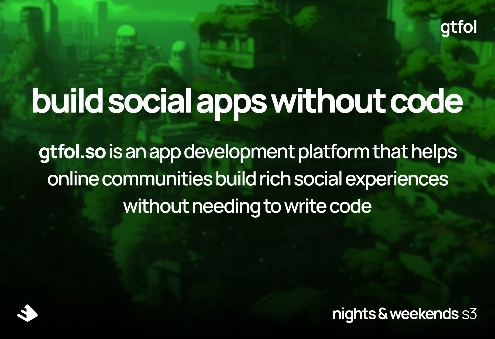
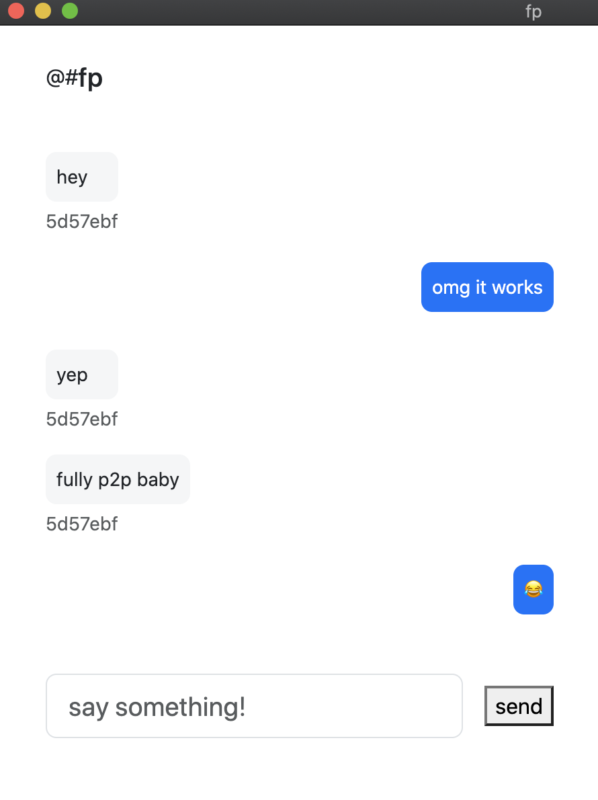
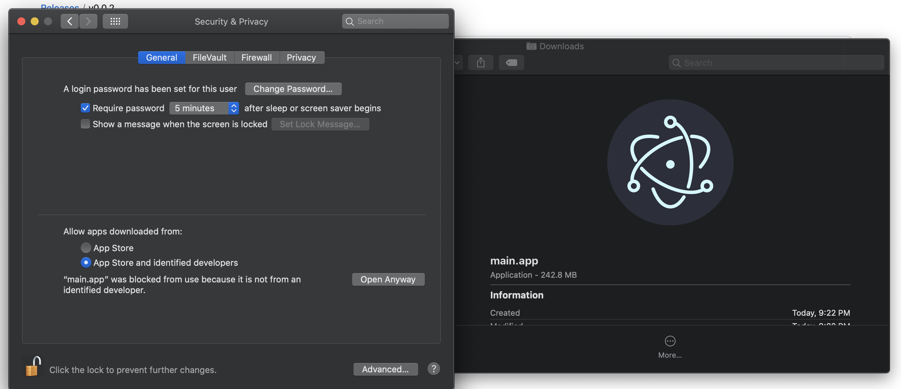

# gtfol

> "localhost? bump that. i'll get you on prod right now"

## for you

claim your custom social app for your community by signing up here [gtfol.so](https://gtfol.so)

fire it up in minutes

fully peer-to-peer and end-to-end encrypted

## about us

we are [Future Proof](https://futureproof.so)

our software empowers technologists of all kinds to build a better web

we've spent the past 2 years teaching people how to build and work in web3/blockchain/dweb

we helped over 30% of our community get paid $ roles in the space

we grew to 500+ members who are women, people of color, queer, trans, and non-binary folks

we learned that what the industry needs today is better tooling so more technologists can build

we believe a better web is possible

do you?

## let's do this

your own personal chat app

| Install for Mac (Intel) |
| ----------- |
| |

after installing, double click `main.app` you'll get a message saying the developer can not be verified.

click "cancel" then go into your securiy and privacy preferences and click "open anyway".

[license](./LICENSE) and [terms](./TERMS)

## don't be a stranger

dm us [@futureproofso](https://twitter.com/futureproofso) about:
- becoming an investor 
- joining our team
- what's bringing you joy
